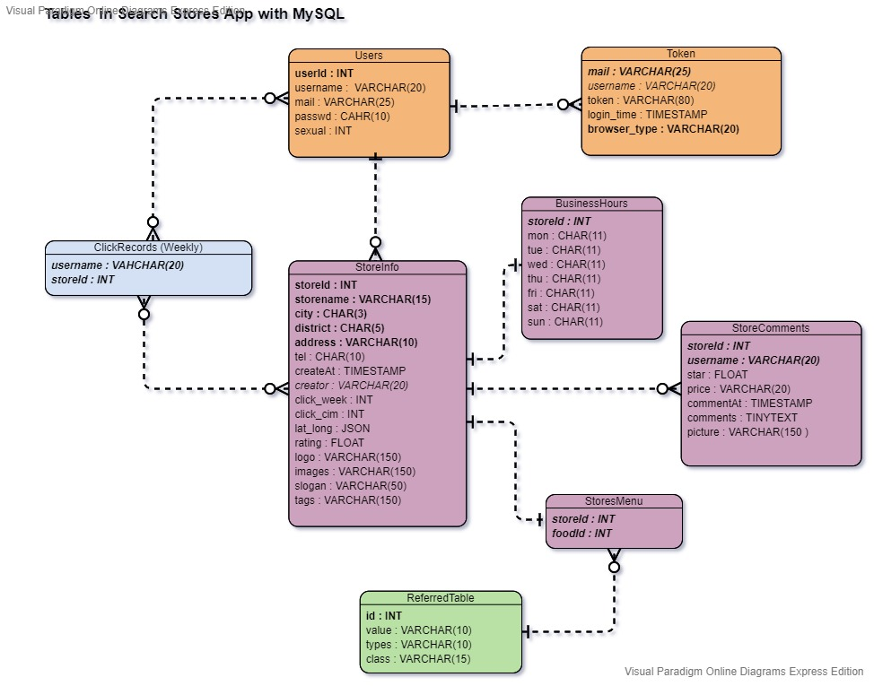

# 
Search Stores Application 

## 
Search Stores Backend 

## Motivation 
Do you have a hard time deciding what to consume for lunch on working day? Do you have a hard time selecting what to eat for dinner after school?  Search Food Application is born for solving such an annoying troubles that you have to face every day to make you a better day. 
## Introduction 
This repository is the backend of the project SearchFood. The frontend repository is [HERE](https://github.com/Psi-team/SearchFoodFrontEnd). The SearchFood Application is born for solving your daily eating problems that you a have hard time deciding what to eat. This application provides you multiple methods, including distance, types, or location, to help you choose your meals.   
The Search Stores Application is developed using 
1. Programming Language : JDK 1.8 
2. Web Framework :  Spring Boot 2.1.7 
3. Database : MySQL 8.0  
4. Build tool : Apache Maven 3.6.0 
5. Third-party package: 
    * org.json 
    * org.slf4j 
  

## Features 
1. Search Stores 
    * Search stores based on the distance from the stores to the place at which the user locates. 
    * Search stores based on the type, e.g. fast food. 
    * Search stores based on the meals, e.g. McDonald's. 
    * Search stores based on the district that the user designates. 
    * Search stores at random.  

2. Comment the Stores
    * Rate for the store from 0 to 5 stars. 
    * Comment on stores in 50 words. 
    * Give your rate and comments for the stores where you have a meal so that the other users can take your comments and rating into accounts before they make decisions. 
    * Every store has hits rate to evaluates the popularity weekly. 

3. Create New Stores 
    * Create a new store information that you recommend in order to make this application more extensive. 

4. Add to Favorites 
    * You can add your favorite stores to your collection and look up in your profile. 

## Architecture 
1.  Frontend
    * The frontend repository is [HERE](https://github.com/Psi-team/SearchFoodFrontEnd). 
    * Deliver data to backend through RESTful api. 

2. Backend 
    * controller   
    Accept the request and JSON data and call the models.  
        
    * model   
    Main business logic and database  

3. Database 
   * Use Mysql 8.0 as the database.   
     

## Todo list 
- [ ] io.jsonwebtoken with Spring Security
- [ ] Google third-part login 